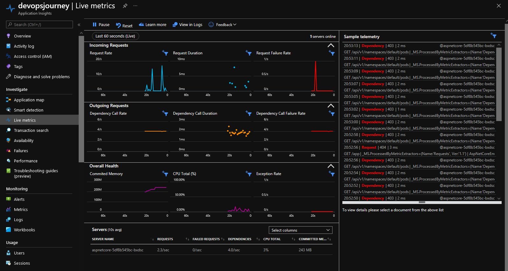
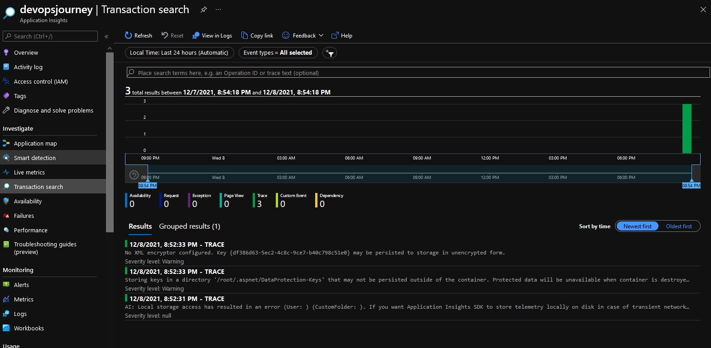
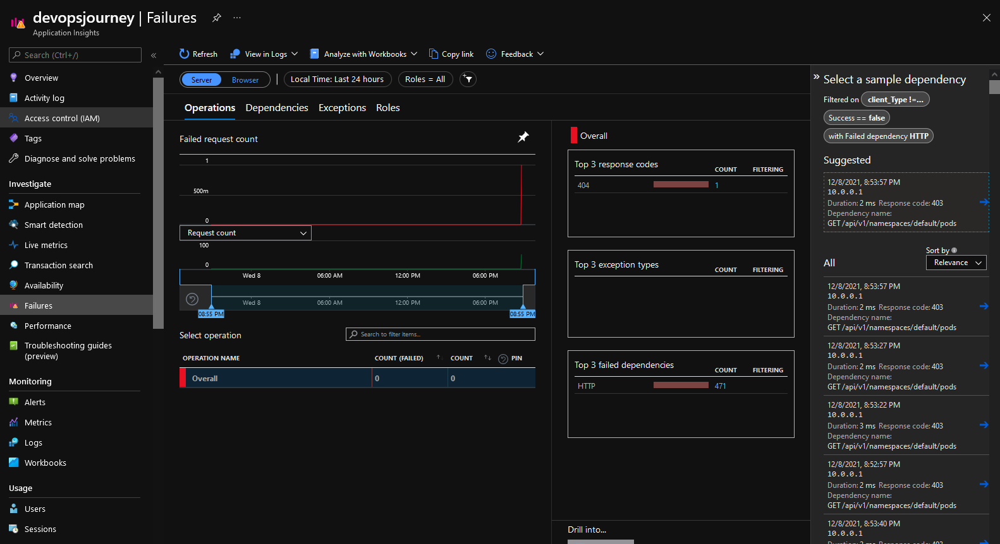
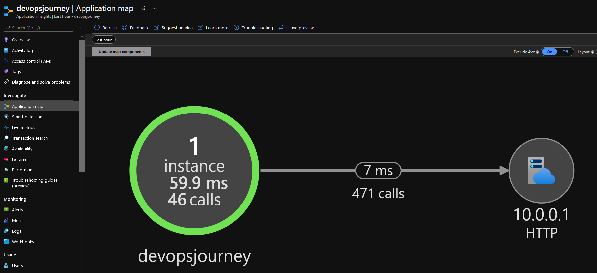
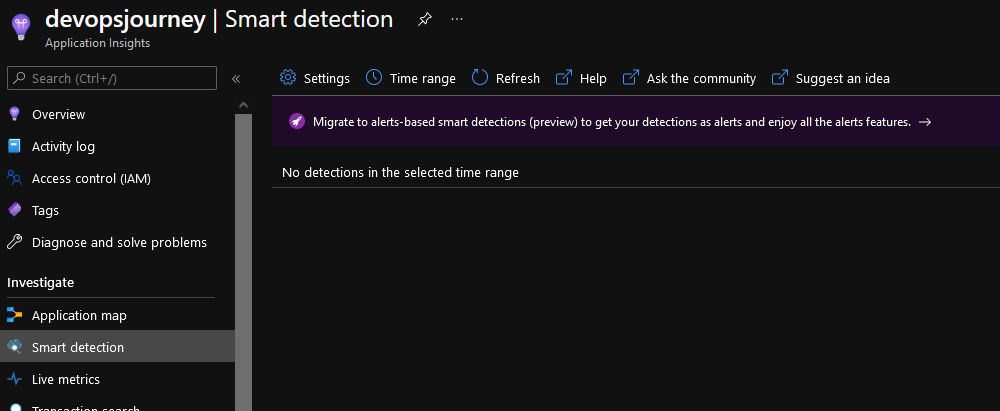
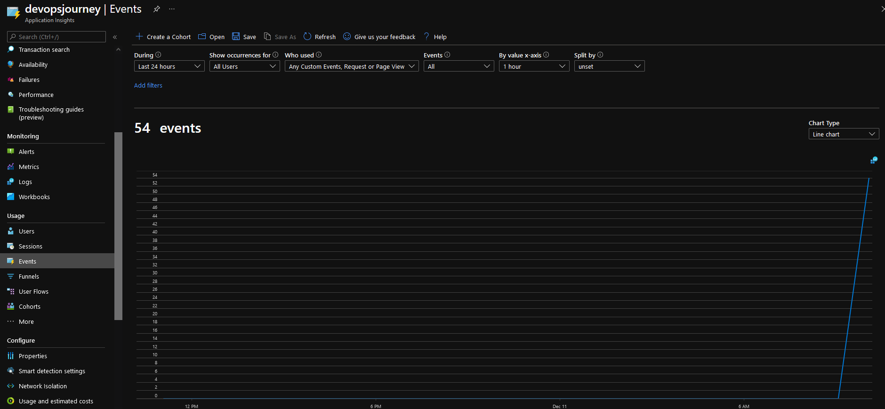
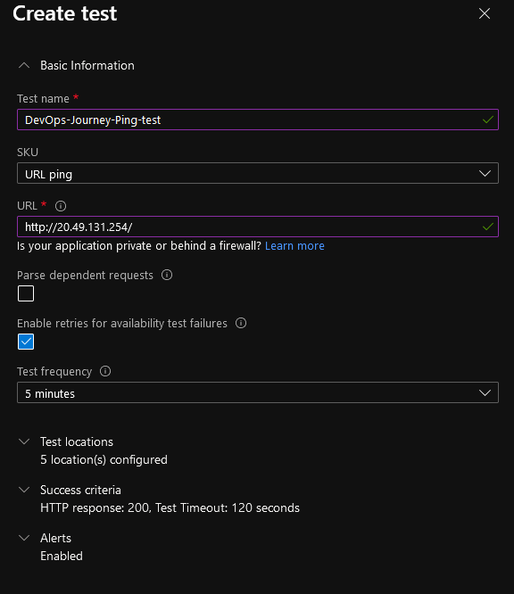
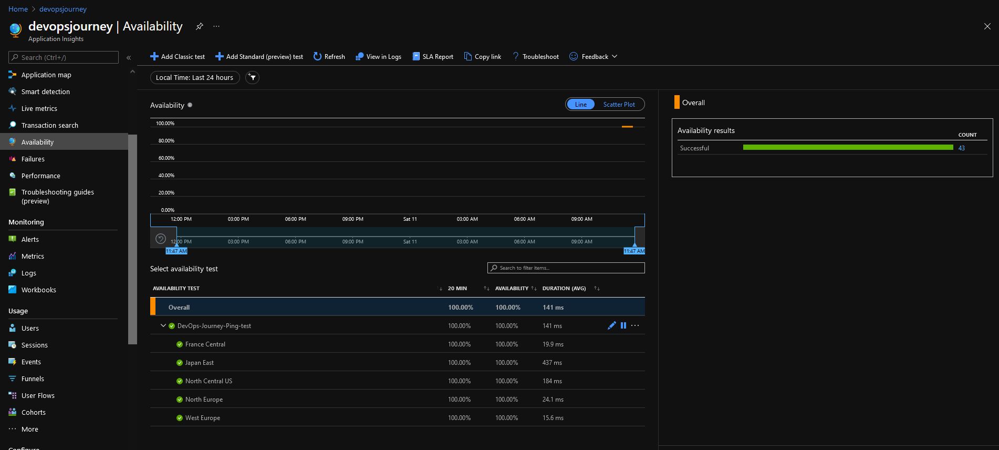
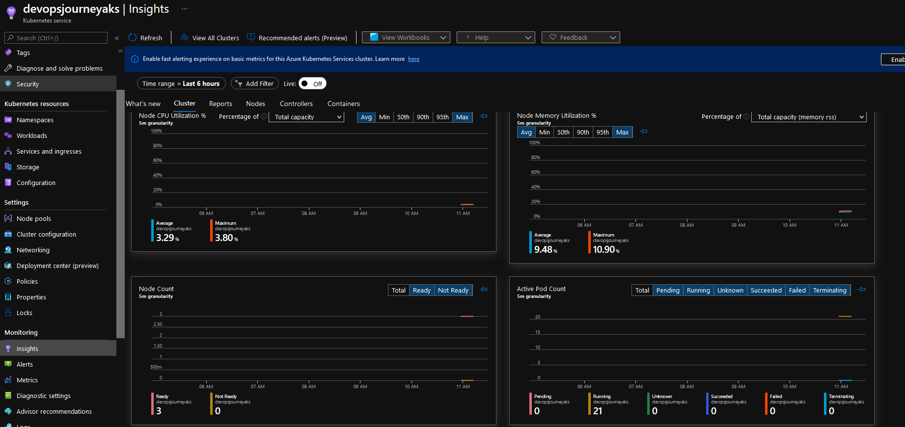

# Using Application Insights to view telemetry data!

# What is Application Insights?

Application Insights, a feature of Azure Monitor, is an extensible Application Performance Management (APM) service for developers and DevOps professionals. Use it to monitor your live applications. It will automatically detect performance anomalies, and includes powerful analytics tools to help you diagnose issues and to understand what users actually do with your app. It's designed to help you continuously improve performance and usability.

# Open Application Insights

Select the Application Insights that you created previously & also have the ingress IP to hand, we will look at some ways to view Application Insights data!

# Live Metrics
When you deploy a new build, watch these near-real-time performance indicators to make sure everything works as expected. 

# Transaction search for instance data
Search and filter events such as requests, exceptions, dependency calls, log traces, and page views.

# Viewing failures easily
Ability to view failures easily within this pain

# Application map
Explore the components of your app, with key metrics and alerts.

# Smart detection and manual alerts
Set up automatic alerts that adapt to your app's normal patterns of telemetry and trigger when there's something outside the usual pattern. You can also set alerts on particular levels of custom or standard metrics.

# Usage analysis
Analyze user segmentation and retention.

# Configure availability test using Application Insights

You can set up recurring tests to monitor availability and responsiveness. Application Insights sends web requests to your application at regular intervals from points around the world. It can alert you if your application isn't responding or responds too slowly.

You can set up availability tests for any HTTP or HTTPS endpoint that's accessible from the public internet. You don't have to make any changes to the website you're testing. In fact, it doesn't even have to be a site that you own. You can test the availability of a REST API that your service depends on.

# Types of tests

There are four types of availability tests:

- URL ping test (classic): You can create this simple test through the portal to validate whether an endpoint is responding and measure performance associated with that response. You can also set custom success criteria coupled with more advanced features, like parsing dependent requests and allowing for retries.
- Standard test (Preview): This single request test is similar to the URL ping test. It includes SSL certificate validity, proactive lifetime check, HTTP request verb (for example GET, HEAD, or POST), custom headers, and custom data associated with your HTTP request.
- Multi-step web test (classic): You can play back this recording of a sequence of web requests to test more complex scenarios. Multi-step web tests are created in Visual Studio Enterprise and uploaded to the portal, where you can run them.
- Custom TrackAvailability test: If you decide to create a custom application to run availability tests, you can use the TrackAvailability() method to send the results to Application Insights.

# Configuring a clasic test

Select Availability -> Add Classic Test

Enter details as below, URL will be the ingress IP that you have been accessing the test application on

Once configured, over time - you will be able to view additional testing information

# Reviewing Log Analytics Container Insights

Access to Container insights is available directly from an AKS cluster by selecting Insights > Cluster from the left pane, or when you selected a cluster from the multi-cluster view. Information about your cluster is organized into four perspectives:

- Cluster
- Nodes
- Controllers
- Containers

The default page opens and displays four line performance charts that show key performance metrics of your cluster.

The performance charts display four performance metrics:

- Node CPU utilization %: An aggregated perspective of CPU utilization for the entire cluster. To filter the results for the time range, select Avg, Min, 50th, 90th, 95th, or Max in the percentiles selector above the chart. The filters can be used either individually or combined.
- Node memory utilization %: An aggregated perspective of memory utilization for the entire cluster. To filter the results for the time range, select Avg, Min, 50th, 90th, 95th, or Max in the percentiles selector above the chart. The filters can be used either individually or combined.
- Node count: A node count and status from Kubernetes. Statuses of the cluster nodes represented are Total, Ready, and Not Ready. They can be filtered individually or combined in the selector above the chart.
- Active pod count: A pod count and status from Kubernetes. Statuses of the pods represented are Total, Pending, Running, Unknown, Succeeded, or Failed. They can be filtered individually or combined in the selector above the chart.

This is only an insight into what Container Insights is capable off, review the [Azure Documentation](https://docs.microsoft.com/en-us/azure/azure-monitor/containers/container-insights-analyze) to see further how it can assist you :)